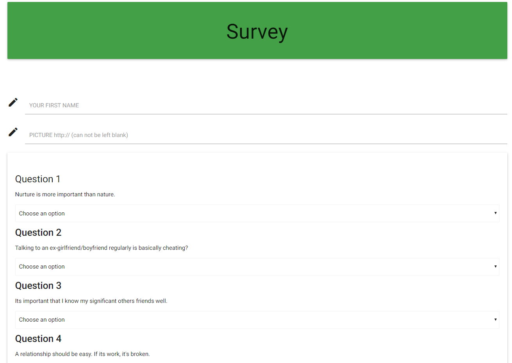

<h1 align="center">friendfinder</h1>

<div align="center">
  <strong>Find someone</strong>
</div>
<div align="center">
  A <code>full-stack</code> application
</div>

<br />

## Table of Contents
- [Goal](#goal)
- [Getting Started](#getting-started)
- [Prerequisites](#example)
- [Installing](#philosophy)
- [Built With](#built-with)
- [Author](#state)
- [License](#license)
- [Application Structure](#application-structure)
- [Deployment](#deployment)
- [Target Audience](#target-audience)
- [API](#api)
- [Installation](#installation)

## Goal
The goal is to use personality questions to link 2 users together with a common bond. 

## Getting Started
Welcome to Friend Finder! 

## Built With
Friend Finder is a full stack node app deployed on Heroku. Data is saved in a file, not in a database. The application uses the express npm package to configure and operate the server, body-parser to pass the json data back and forth between files & functions, and fs to read & write from the data files on the server. Various routes are setup to complete the survey, view the JSON API, and post data into the app. A general catch-all route will bring all users to the homepage, regardless of the path the user attempts to access.

## Example

- homepage

  

- survey

  

## Target Audience
Casual users looking to see who they best resemble will enjoy the app. A community of friends, co-workers, or students can compare their interests to each other as well.


## Application Structure
Code for running the modules located in the root of the application

```
FriendFinder/server.js
```
objects array where I store all the friends' details

```
FriendFinder/app/data/friends.js
```
code to display the home page which has bootstrap jumbotron header,glyphicons, a button to go to survey page, and links to list all friends' details in json format and link to git repository.

```
FriendFinder/app/public/home.html
```
the code to display the survey page with fields name, link to photo, and 10 dropdown questions for the user to choose to find the best match, and a submit button. Also has link to Clear All which clears the user input to start fresh, another link to list all friends' details in json format, and another to git repository. And a modal to display the result (best match). I have used css, and js bootstrap components to format the page and components. Also I have added the Front-end Javascript code to handle the submit and clear all events.

```
FriendFinder/app/public/survey.html
```
* The clear all event will reload the page which clears the input to start fresh.
* The submit event first validates the input whether all fields are entered. If any field is missing data it'll display an alert asking the user to enter all fields; else it'll do a POST request to the express server sending the current URL and user entered data. Once the call is complete it'll display a Modal with the best match person's name and photo (if the photo is not available it'll display a placeholder image).

```
FriendFinder/app/routing/htmlRoutes.js
```

```
FriendFinder/app/routing/apiRoutes.js
```
 handles the GET request to list all friends in json format, and the POST request to find the best match. When the POST request is hit, the code will get the scores array for the current user and compares with each of the friend's scores in the existing pool, finds the difference (difference in each answer score and adds them all together), and stores the total difference and the friends array index in a temporary array. Once all the friend's scores are compared the temporary array will be sorted by the difference, and this will give me the best match at the 0th index. Then the POST request will return the index of 0 which has the best match back to the client.

code to handle the api GET requests on /survey and * for anything else other than survey including /home, and displays the corresponding html page.

## API
This section provides documentation on how each function 


`friendfinder` is a full stack node app deployed on Heroku. Data is saved on a file, not in a database. It uses [Express](https://www.npmjs.com/package/express) to configure and operate the server, [Body-Parser](https://www.npmjs.com/package/body-parser) to pass the json data back and forth between files & functions, and [fs](https://nodejs.org/api/fs.html) to read & write from the data files on the server. Various routes are setup to complete the survey, view the JSON API, and post data into the app. A general catch-all route will bring all users to the homepage, regardless of the path the user attempts to access.
 *better* 
 
friendfinder implements friend matching based on the user's responses to a ten question survey. The user responds to questions with values from 1 (Strongly Disagree) to 5 (Strongly Agree). When the survey is submitted, an existing user record closest to the current user's responses is found and returned. The closest set of user responses is defined as the set with the lowest absolute difference for all ten questions combined.

Friend Finder application is meant to simulate a simple dating app. The application is implemented using a Node.js and Express server on the back end and the Materialize CSS framework on the front end.

## [Usage Overview](#usage-overview)

### **Installation**

```swift
git clone git@github.com:JonathanBrownCFA/FriendFinder.git
cd friend-finder
npm install
}
```
### **Demo**

Friend Finder is deployed to Heroku. Please check it out here.

## License

FriendFinder is provided under the [MIT License](https://github.com/vhesener/Closures/blob/master/LICENSE).

```text
The MIT License (MIT)
Copyright (c) 2017 Vincent Hesener
 
Permission is hereby granted, free of charge, to any person obtaining a copy of this software and
associated documentation files (the "Software"), to deal in the Software without restriction,
including without limitation the rights to use, copy, modify, merge, publish, distribute,
sublicense, and/or sell copies of the Software, and to permit persons to whom the Software
is furnished to do so, subject to the following conditions:
 
The above copyright notice and this permission notice shall be included in all copies or
substantial portions of the Software.
 
THE SOFTWARE IS PROVIDED "AS IS", WITHOUT WARRANTY OF ANY KIND, EXPRESS OR IMPLIED, INCLUDING BUT
NOT LIMITED TO THE WARRANTIES OF MERCHANTABILITY, FITNESS FOR A PARTICULAR PURPOSE AND
NONINFRINGEMENT. IN NO EVENT SHALL THE AUTHORS OR COPYRIGHT HOLDERS BE LIABLE FOR ANY CLAIM,
DAMAGES OR OTHER LIABILITY, WHETHER IN AN ACTION OF CONTRACT, TORT OR OTHERWISE, ARISING FROM,
OUT OF OR IN CONNECTION WITH THE SOFTWARE OR THE USE OR OTHER DEALINGS IN THE SOFTWARE.
```
## Template

These instructions will get you a copy of the project up and running on your local machine for development and testing purposes. See deployment for notes on how to deploy the project on a live system.

### Prerequisites

What things you need to install the software and how to install them

```
Give examples
```

### Installing

A step by step series of examples that tell you have to get a development env running

Say what the step will be

```
Give the example
```

And repeat

```
until finished
```

End with an example of getting some data out of the system or using it for a little demo

## Running the tests

Explain how to run the automated tests for this system

### Break down into end to end tests

Explain what these tests test and why

```
Give an example
```

### And coding style tests

Explain what these tests test and why

```
Give an example
```

## Deployment

Add additional notes about how to deploy this on a live system


## Versioning

We use [SemVer](http://semver.org/) for versioning. For the versions available, see the [tags on this repository](https://github.com/your/project/tags). 

## Author

* **Jonathan Brown** 
See also the list of [contributors](https://github.com/your/project/contributors) who participated in this project.

# FriendFinder

In this application the User can answer few questions and find a compatible friend who has similar thought processes. This project is a full stack Node.js application, also deployed to Heroku. 

### [Heroku Live Demo](https://friendfinder-jbrown.herokuapp.com)

The package has the following files - server.js, package.json, app/data/friends.js, app/public/home.html, app/public/survey.html, app/routing/apiRoutes.js, app/routing/htmlRoutes.js, .gitignore (to ignore node_modules folder from uploading to git repo). 

